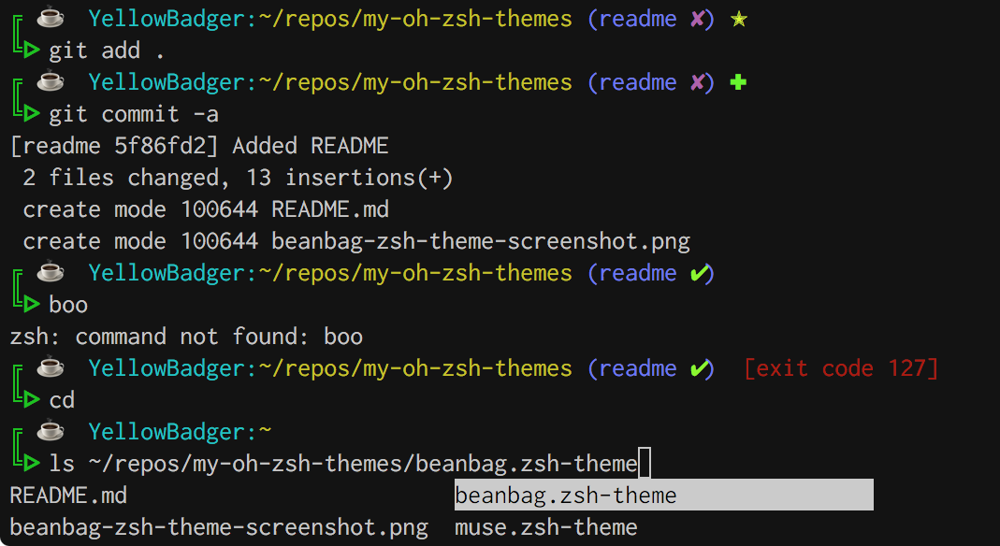
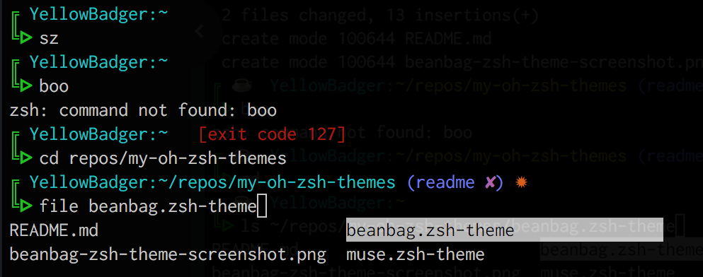

# my-oh-zsh-themes

All the theme I have created or modified live here but my primary one is
`beanbag.zsh-theme`.

_Note: the screenshots below have what looks like ghosting... its where my terminal is translucent._

## beanbag

- two line prompt with ☕️ emoji, hostname, and current directory
- git repo indicators
- last exit code if not 0
- tab completion by tabbing through list

## muse

Basically the same as beanbag but with fewer colors and no coffee
